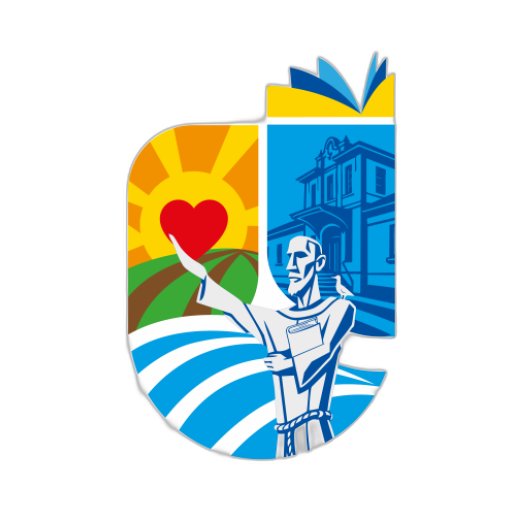
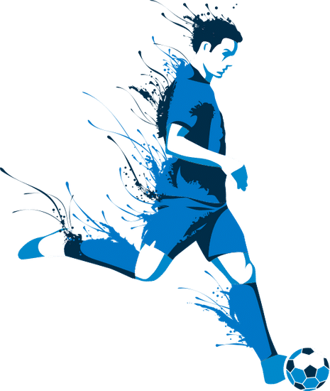

<div align="center">
  

  <h1>Assis Futsal</h1>

  <p><strong>Portal institucional do projeto Assis Futsal, criado para apresentar sua história, categorias, atletas, comissão técnica e formas de participação.</strong></p>

  <p>
    
    
    
    
  </p>

  <p>
    <a href="#-sobre-o-projeto">Sobre</a> &bull;
    <a href="#-funcionalidades">Funcionalidades</a> &bull;
    <a href="#-como-executar">Como executar</a> &bull;
    <a href="#-estrutura-do-projeto">Estrutura</a> &bull;
    <a href="#-autores">Autores</a>
  </p>
</div>

---

<p align="center">
  
</p>

## 📍 Sobre o projeto

O **Assis Futsal** é um site institucional multipágina dedicado ao projeto esportivo da cidade de Assis, no interior de São Paulo. A aplicação centraliza informações sobre a trajetória da equipe, suas conquistas, categorias de base, atletas, treinadores, locais e horários de treino.

O portal também oferece um canal de adesão para jovens interessados em participar do projeto. Toda a interface foi desenvolvida com tecnologias web nativas, sem framework e sem etapa de build.

### Objetivos

- Divulgar o trabalho realizado pelo Assis Futsal;
- preservar e apresentar a história e as conquistas do projeto;
- facilitar o acesso às informações sobre atletas, categorias e treinadores;
- informar locais e horários de treinamento;
- aproximar novos atletas por meio de um formulário de adesão;
- oferecer uma experiência consistente em computadores, tablets e celulares.

## ✨ Funcionalidades

### Página inicial

- Apresentação geral do projeto e de suas categorias;
- cards com destaques sobre treinos, equipe Sub-20 e Ginásio Jairão;
- navegação suave entre seções;
- gráfico de pizza com a distribuição etária dos alunos;
- gráfico de barras com a distribuição dos jogadores por posição.

### História

- Linha do tempo do projeto, de sua origem como Vocem Futsal à fase atual;
- relação de títulos e resultados das categorias Adulto, Sub-16, Sub-18 e Sub-20;
- apresentação dos planos de continuidade e expansão das categorias de base.

### Elenco

- Escalação visual da equipe Sub-20 em uma quadra;
- seletor interativo com as formações `1-2-2`, `1-3-1`, `1-2-1-1` e `1-1-3`;
- organização dos atletas por posição;
- tabelas dos elencos Sub-16 e Sub-18;
- identificação dos treinadores de cada categoria.

### Contato e adesão

- Orientações para jovens interessados em fazer parte do projeto;
- endereço do local de treinamento e horários por categoria;
- dados oficiais da Secretaria Municipal de Esportes;
- links para os perfis do projeto no Instagram;
- apresentação da comissão técnica, com idade calculada dinamicamente;
- formulário com validação de nome, e-mail, telefone e mensagem;
- envio do formulário pelo EmailJS, com feedback visual de processamento, sucesso ou erro.

### Experiência de navegação

- Layout responsivo para diferentes tamanhos de tela;
- menu desktop e menu lateral mobile com animação;
- destaque automático da página ativa na barra de navegação;
- navbar e footer reutilizados entre todas as páginas;
- botão de retorno ao topo com rolagem suave;
- identidade visual baseada nas cores do projeto.

## 🛠️ Tecnologias utilizadas

| Tecnologia | Utilização |
| --- | --- |
| **HTML5** | Estrutura semântica das páginas e do conteúdo |
| **CSS3** | Layouts responsivos, animações, variáveis de tema e media queries |
| **JavaScript (ES6+)** | Interações, validação, componentes e escalação dinâmica |
| **Chart.js** | Gráficos estatísticos da página inicial |
| **EmailJS** | Envio do formulário de adesão diretamente pelo navegador |
| **Google Fonts** | Tipografias DM Sans e Montserrat |

> As bibliotecas externas e as fontes são carregadas por CDN. Portanto, alguns recursos dependem de conexão com a internet.

## 🚀 Como executar

### Pré-requisitos

Você precisa apenas de:

- um navegador moderno;
- Git para clonar o repositório;
- um servidor HTTP local, como a extensão **Live Server** do VS Code ou o servidor nativo do Python.

### 1. Clone o repositório

```bash
git clone https://github.com/DarioKlein/assis-futsal.git
cd assis-futsal
```

### 2. Inicie um servidor local

Com Python:

```bash
python -m http.server 5500
```

No Windows, caso o comando anterior não esteja disponível:

```bash
py -m http.server 5500
```

Depois, acesse [http://localhost:5500](http://localhost:5500). O arquivo `index.html` encaminhará automaticamente para a página inicial.

Também é possível abrir o diretório no VS Code, clicar com o botão direito em `index.html` e selecionar **Open with Live Server**.

> [!IMPORTANT]
> Não abra as páginas diretamente pelo protocolo `file://`. A navbar e o footer são carregados com `fetch()`, que precisa de um servidor HTTP para funcionar corretamente na maioria dos navegadores.

## 🧩 Como o projeto funciona

Cada página possui seus próprios arquivos HTML, CSS e, quando necessário, JavaScript. Os estilos globais ficam em `css/global.css` e definem o reset, a tipografia e a paleta de cores compartilhada.

A navbar e o footer ficam isolados em `components/`. Ao carregar uma página, `js/utils.js` busca esses fragmentos de HTML, injeta-os nos elementos marcados com `.component-injection-target` e adiciona os respectivos scripts ao documento.

```text
Página HTML
    └── js/utils.js
          ├── carrega components/navbar/navbar.html
          ├── ativa components/navbar/navbar.js
          ├── carrega components/footer/footer.html
          └── ativa components/footer/footer.js
```

Os gráficos da página inicial são renderizados no navegador pelo Chart.js. Na página de elenco, as coordenadas das formações ficam definidas em JavaScript e os jogadores são reposicionados sempre que o usuário altera a opção selecionada. Na página de contato, os dados são validados antes do envio pelo EmailJS.

## 📁 Estrutura do projeto

```text
assis-futsal/
├── assets/
│   ├── favicon/              # Favicons e manifesto do site
│   ├── icons/                # Logo e ícones da interface
│   └── images/               # Fotografias e imagens das páginas
├── components/
│   ├── footer/               # Marcação, estilos e comportamento do rodapé
│   └── navbar/               # Navegação desktop e mobile
├── css/
│   └── global.css            # Reset e estilos globais
├── js/
│   └── utils.js              # Carregamento dos componentes compartilhados
├── pages/
│   ├── contato/              # Contato, treinadores e formulário de adesão
│   ├── elenco/               # Atletas e formações táticas
│   ├── historia/             # Linha do tempo, conquistas e expansão
│   └── inicio/               # Apresentação, destaques e estatísticas
├── index.html                     # Redirecionamento para a página inicial
└── readme.md
```

## 🎨 Identidade visual

A paleta principal está centralizada em variáveis CSS, o que facilita futuras alterações:

| Cor | Hexadecimal | Uso principal |
| --- | --- | --- |
| Azul institucional | `#1c4c83` | Navegação, fundos e títulos |
| Azul claro | `#1092d7` | Destaques e elementos interativos |
| Amarelo | `#f0d067` | Énfase e estados ativos |
| Verde | `#479f34` | Elementos complementares e gráficos |

## 🧪 Validação do formulário

Antes do envio, o formulário verifica:

- preenchimento de todos os campos;
- nome com no máximo 60 caracteres;
- formato válido de e-mail;
- telefone com pelo menos 8 dígitos;
- mensagem com no máximo 300 caracteres.

As credenciais de serviço, template e chave pública usadas pelo EmailJS estão configuradas em `pages/contato/contato.js`. Para utilizar outra conta ou outro modelo de e-mail, substitua esses identificadores pelos valores fornecidos no painel do EmailJS.

## 🤝 Como contribuir

Contribuições são bem-vindas. Para propor uma melhoria:

1. faça um fork do repositório;
2. crie uma branch para sua alteração: `git checkout -b feature/minha-melhoria`;
3. faça suas modificações e revise o site em diferentes tamanhos de tela;
4. registre um commit descritivo;
5. envie a branch para o seu fork e abra um Pull Request.

Ao contribuir, preserve a estrutura dos componentes, a identidade visual e a responsividade das quatro páginas.

## 👥 Autores

Desenvolvido por:

- [Dario Klein](https://github.com/DarioKlein)
- [Luis Felipe da Silva](https://github.com/LuisFelipedaSilvaE)

## 📄 Licença

Este repositório não possui um arquivo de licença no momento. Para reutilização, distribuição ou modificação do conteúdo, consulte os responsáveis pelo projeto.

---

<div align="center">
  Feito com ⚽ e dedicação para o <strong>Assis Futsal</strong>.
</div>
